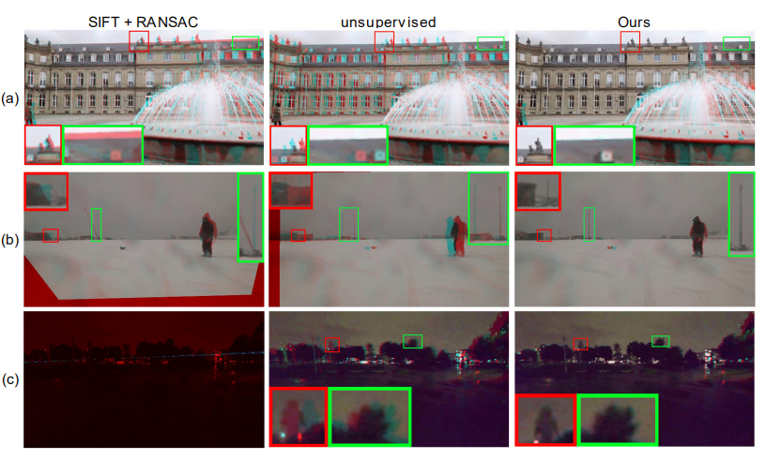
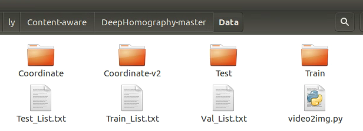
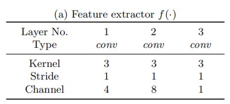

# Content-Aware Unsupervised Deep Homography Estimation
###### 本篇论文是基于非监督学习的神经网络，吸收了Daniel监督学习的思路采用深度神经网络估计单应矩阵，预测的形式依然采用四个点的8维偏移量。但本篇区别于前两篇的改进点在于它提出了利用特征图而不是原图像来计算损失函数，并且它提出了mask的思路来实现对图像中纹理较少和运动等影响匹配的情形进行削弱，对图像中特征明显的部分加大权重，以此同时实现类ransac和类Attention机制的作用。<br/><br/><br/>


> - 论文来源：[Content-Aware Unsupervised Deep Homography Estimation.(pdf)](https://arxiv.org/pdf/1909.05983)
> - 数据集：合成数据集MSCOCO2014/2017、视频数据集Content-Aware-DeepH-Data
> - 参考主页：[JirongZhang(项目源码)](https://github.com/JirongZhang/DeepHomography)

<br/><br/><br/>


## 1. 主要思路
首先根据下图，我们分析基于特征的方法和基于深度学习的方法存在的缺点和不足：
<div align = "center">
  
</div>

在上图中分别取了三种具有代表性的场景：
1. 有运动的前景
2. 包含纹理较少的场景（雪地、海洋或天空等）
3. 光照过强或过弱

图中是两张图叠在一起的结果，其中一张图只叠加了图像的蓝绿通道，另一张图像只保留红色通道。显示红色或青色的地方就是没有对齐的部分，反之显示原色的部分是对齐的。

#### 基于特征的单应估计
> 图中第一列的就是特征估计单应矩阵的结果，出现了很大部分没有对齐的地方，尤其表现在没有纹理和光照过暗的场景下。造成配准结果较差的原因有：
> 1. 匹配点少
> 2. 特征点**分布不均匀**
> 3. 需要过滤场景中**不占主导地位的平面**或**运动的物体**上的特征点


#### 基于深度学习的单应矩阵预测
> 图中第二列为2018年Nguyen团队提出的非监督学习的框架，对真实数据的配准，基于深度学习的方法对于所有情形上的配准结果都比较一致。在低光照情形下，甚至比SIFT的效果好得多，这也印证了Unsupervised论文中的实验结论。

#### 基于内容学习的单应估计
- 本文主要提出了利用一个特征提取网络提取原图像的特征图
- 利用mask预测网络来对图像的内容进行加权，把注意力放在主要信息上来预测单应矩阵，并在计算损失函数时利用mask过滤非主导信息。


<br/><br/><br/>
## 2. 数据集
本文的数据集为Content-Aware-DeepH-Data，是作者团队拍摄的视频数据。视频数据放置在项目源码文件夹内的/Data文件夹内。数据的读取方式是从Train_List.txt文件中读取，每一行记录两帧的文件名。txt的生成方式本文没有给出，是由个人定义的。项目文件中给出的两帧图像间隔的帧数经观察为2~8帧，因此两幅图像之间的重叠率基本在70%以上。
<div align="center">

</div>
<br/>
数据集的读取函数在项目文件的dataset.py中，主要就是根据Train_List.txt文件的文件名读取文件，并对图像做预处理。return的对象包含：两张原图，输入网络的两个patch，patch的索引和patch的四个顶点坐标。

```python
        org_img = np.concatenate([img_1, img_2], axis=0)

        x = np.random.randint(self.rho, self.WIDTH - self.rho - self.patch_w)
        y = np.random.randint(self.rho, self.HEIGHT - self.rho - self.patch_h)

        input_tesnor = org_img[:, y: y + self.patch_h, x: x + self.patch_w]

        y_t_flat = np.reshape(self.y_mesh, (-1))
        x_t_flat = np.reshape(self.x_mesh, (-1))
        patch_indices = (y_t_flat + y) * self.WIDTH + (x_t_flat + x)

        top_left_point = (x, y)
        bottom_left_point = (x, y + self.patch_h)
        bottom_right_point = (self.patch_w + x, self.patch_h + y)
        top_right_point = (x + self.patch_w, y)
        h4p = [top_left_point, bottom_left_point, bottom_right_point, top_right_point]

        h4p = np.reshape(h4p, (-1))

        org_img = torch.tensor(org_img)
        input_tesnor = torch.tensor(input_tesnor)
        patch_indices = torch.tensor(patch_indices)
        h4p = torch.tensor(h4p)

        return (org_img, input_tesnor, patch_indices, h4p)
```


<br/><br/><br/>
## 3. 网络结构
如下图所示是本文网络的整体框架，主要集中在上一章节的三个大改进上。输入阶段是两张大小一样的图像，每幅图像都分别进入一个特征提取网络和一个Mask预测网络。特征提取网络输出的图像$F_a$和mask预测网络输出的图像$M_a$大小一致，最后进行一个矩阵的点乘得到图像$G_a$。两个经过点乘的图像输入单应性估计网络得到预测的8维向量结果。
<br/>
<div align=center>
  
  </div>
  
<br/>

以下是本文网络最重要的三个网络：
#### 3.1 Feature extractor(特征图提取)
根据源码的书写，输入特征提取网络的图像不是原图org_img(大小为640x360)而是选取的input_tensor(大小为560x315)。
<br/>
<div align=center>
  
  </div>
<br/>


```python
self.ShareFeature = nn.Sequential(
            nn.Conv2d(1, 4, kernel_size=3, padding=1, bias=False),
            nn.BatchNorm2d(4),
            nn.ReLU(inplace=True),

            nn.Conv2d(4, 8, kernel_size=3, padding=1, bias=False),
            nn.BatchNorm2d(8),
            nn.ReLU(inplace=True),

            nn.Conv2d(8, 1, kernel_size=3, padding=1, bias=False),
            nn.BatchNorm2d(1),
            nn.ReLU(inplace=True),
        )
```


<br/>

#### 3.2 Mask predictor(mask预测)
输入该mask预测网络的图像是原图大小，然后利用函数getPatchFromFullimg得到patch大小的图像。
<br/>
<div align=center>
  
  </div>
<br/>


```python
self.genMask = nn.Sequential(
            nn.Conv2d(1, 4, kernel_size=3, padding=1, bias=False),
            nn.BatchNorm2d(4),
            nn.ReLU(inplace=True),

            nn.Conv2d(4, 8, kernel_size=3, padding=1, bias=False),
            nn.BatchNorm2d(8),
            nn.ReLU(inplace=True),

            nn.Conv2d(8, 16, kernel_size=3, padding=1, bias=False),
            nn.BatchNorm2d(16),
            nn.ReLU(inplace=True),

            nn.Conv2d(16, 32, kernel_size=3, padding=1, bias=False),
            nn.BatchNorm2d(32),
            nn.ReLU(inplace=True),

            nn.Conv2d(32, 1, kernel_size=3, padding=1, bias=False),
            nn.BatchNorm2d(1),
            nn.Sigmoid(),
        )
```

<br/>

#### 3.3 Homography estimator(单应性估计)
<br/>
<div align=center>
  
  </div>
<br/>

在此网络中，我们注意到一个问题——该网络的输入图像大小是不固定的。这是因为在单应估计网络这部分，倒数第二层采用了一个**全局平均池化层**。经过该层的数据变为512维的张量，最后进入全连接层输出一个8维的结果。该部分经讨论，发现该网络结构是在resnet结构上进行的修改，单应性估计的结构就是采用的resnet的代码。而生成特征图网络和mask预测网络是作者在resnet源码基础上增加的。


```python
        self.conv1 = nn.Conv2d(2, 64, kernel_size=7, stride=2, padding=3,
                               bias=False)
        self.bn1 = nn.BatchNorm2d(64)
        self.relu = nn.ReLU(inplace=True)
        self.maxpool = nn.MaxPool2d(kernel_size=3, stride=2, padding=1)
        self.layer1 = self._make_layer(block, 64, layers[0])
        self.layer2 = self._make_layer(block, 128, layers[1], stride=2)
        self.layer3 = self._make_layer(block, 256, layers[2], stride=2)
        self.layer4 = self._make_layer(block, 512, layers[3], stride=2)
        self.avgpool = nn.AvgPool2d(7, stride=1)
        self.fc = nn.Linear(512 * block.expansion, num_classes)
        ...
        ...
        patch_1_res = torch.mul(patch_1, mask_I1)
        patch_2_res = torch.mul(patch_2, mask_I2)
        x = torch.cat((patch_1_res, patch_2_res), dim=1)   #此处为合并两个patch输入单应估计模型

        x = self.conv1(x)
        x = self.bn1(x)
        x = self.relu(x)
        x = self.maxpool(x)

        x = self.layer1(x)
        x = self.layer2(x)
        x = self.layer3(x)
        x = self.layer4(x)

        x = self.avgpool(x)
        x = x.view(x.size(0), -1)
        x = self.fc(x)
        
        H_mat = DLT_solve(h4p, x).squeeze(1)


```
<br/>

#### 3.4 Triplet Loss函数
网络在构建loss函数的时候采用了TripletMarginLoss来构建损失函数。

<br/>
<div align=center>
  
  </div>
<br/>

损失函数的形式化表达为：
$$
 L_n({I_a}\',{I_b})=\frac{\sum_{i}{M_a}\'{M_b}\cdot \Vert {F_a}\'-F_b \Vert_1}{\sum_{i}{M_a}\'M_b}
 
 L(I_a,I_b)=\Vert F_a-F_b \Vert_1

 \displaystyle \min_{m,f,h}L_n({I_a}\', I_b)+L_n({I_b}\',I_a)-\lambda L(I_a,I_b)+\mu \Vert H_{ab}H_{ba}-I \Vert_2^2
$$


```python
        pred_I2 = transform(patch_size_h, patch_size_w, M_tile_inv, H_mat, M_tile,
                            org_imges[:, :1, ...], patch_indices, batch_indices_tensor)   #利用预测出的H_mat对原图I1进行变形转到I2的图像坐标系下
        pred_Mask = transform(patch_size_h, patch_size_w, M_tile_inv, H_mat, M_tile,
                            mask_I1_full, patch_indices, batch_indices_tensor)            #同样对I1的mask进行变形

        pred_Mask = normMask(pred_Mask)                                                   
 
        mask_ap = torch.mul(mask_I2, pred_Mask)

        sum_value = torch.sum(mask_ap)
        pred_I2_CnnFeature = self.ShareFeature(pred_I2)
 
        feature_loss_mat = triplet_loss(patch_2, pred_I2_CnnFeature, patch_1)

        feature_loss = torch.sum(torch.mul(feature_loss_mat, mask_ap)) / sum_value
        feature_loss = torch.unsqueeze(feature_loss, 0)
```


<br/><br/>
## 4. 实验结果


<br/>


<br/><br/><br/><br/><br/>
#### 结论


<br/><br/><br/>


## 5.复现实验
### 合成数据集过程


