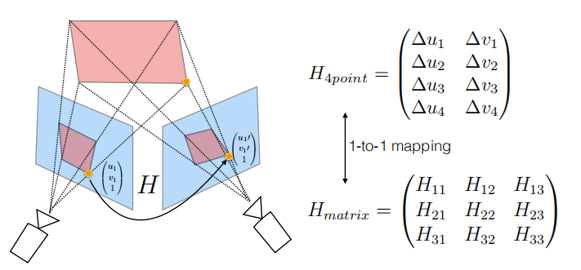

# Deep Image Homography Estimation  
###### 本篇论文是基于监督学习的神经网络，网络以两幅合成的patch作为输入（两者间存在已知的单应变换关系H），预测输出对应H的8个参数（四个顶点的偏移量）。因为数据集是手工合成的，因而该网络的ground truth也是已知的，所以该思路是在监督下训练神经网络。<br/><br/><br/>


> - 论文来源：[DeTone, D., Malisiewicz, T., & Rabinovich, A. (2016). Deep image homography estimation.(pdf)](https://arxiv.org/pdf/1606.03798)
> - 数据集：合成数据集MSCOCO2014/2017
> - 参考主页（源码未开源）：
>> 1. [alexhagiopol](https://github.com/alexhagiopol/deep_homography_estimation)
>> 2. [mazenmel](https://github.com/mazenmel/Deep-homography-estimation-Pytorch)
>> 3. [**mez**](https://github.com/mez/deep_homography_estimation)(包含数据集预处理可视化全过程的ipynb文件)

<br/><br/><br/>


## 1. 主要思路
本文希望通过输入两幅大小一致的图像由网络学习得到**8个参数**，对应两幅图像之间存在的单应关系（矩阵H为8DoF）。
#### 矩阵H形式化
单应性矩阵的表达$H_{4point}$转化为对第一幅图像四个顶点坐标的8个维度（$x_i$, $y_i$, $i$=1, 2, … 8 ）的偏移$H_{4point}$。
#### 4-points形式化的好处
相比较3x3的参数化形式，由于H中混合了旋转成分、平移成分、尺度成分和错切成分。平移分量比旋转和错切分量在数值上变换更大。当计算矩阵误差时，两者对矩阵值的影响都很大，但旋转分量的差值对L2损失函数所造成的**影响比重**比平移向量小。
<br/>
<div align=center>

</div>


<br/><br/><br/>
## 2. 合成数据集
> - 来源：[MSCOCO](https://cocodataset.org/#download) 2014 train/val/testing
> - 合成方法：
>> 1. 对于MSCOCO数据集的图像，选定一个**随机的位置点p**
>> 2. 以p为patch的左上角顶点，确定长宽均为128的**patchA**
>> 3. 对patchA的四个顶点做x,y轴上随机的摆动，得到4-points长度为**8维的偏移量**
>> 4. 四个顶点变换前的坐标到变换后的坐标存在一个单应变换矩阵HAB，将原图像乘上HBA（逆矩阵）得到warped图像
>> 5. 在warped图像上同一位置p上取一个128x128大小的patch名为**patchB**


<br/>
<div align=center>
  
  </div>
  
### 合成数据集代码示例
> 该代码来自mazenmel主页的[DataGeneration文件](https://github.com/mazenmel/Deep-homography-estimation-Pytorch/blob/master/DataGenerationAndProcessing.py)
> <br/>详细的可视化过程见mez主页的[data_generation文件](https://github.com/mez/deep_homography_estimation/blob/master/Dataset_Generation_Visualization.ipynb)
 ```python
    img = cv2.imread(path+'/%s'%image,0)
    img = cv2.resize(img,(320,240))
 ```
 在此处将COCO数据集内的图像均resize为宽为320，高为240的图像。
```python
    rho          = 32
    patch_size   = 128
    top_point    = (32,32)
    left_point   = (patch_size+32, 32)
    bottom_point = (patch_size+32, patch_size+32)
    right_point  = (32, patch_size+32)
    test_image = img.copy()
    four_points = [top_point, left_point, bottom_point, right_point]
```
此处固定了左上角p位置的坐标为(32,32)，patch的大小为128\*128，则可以确定patchA四个顶点的坐标four_points。位置p的坐标实际应当也取一个范围内的随机值，这里简化为固定点。
```python
    perturbed_four_points = []
    for point in four_points:
        perturbed_four_points.append((point[0] + random.randint(-rho,rho), point[1]+random.randint(-rho,rho)))
```
perturbed_four_points作为四个点偏移后坐标的集合，rho是四个点在xy方向上偏移的最大量，因此此处取了(-rho,rho)之间的随机整数。
```python
    H = cv2.getPerspectiveTransform( np.float32(four_points), np.float32(perturbed_four_points) )
    H_inverse = inv(H)

    warped_image = cv2.warpPerspective(img,H_inverse, (320,240))
```
patchA到patchB之间的单应矩阵由opencv的函数计算为H，对**原图**乘上H的逆矩阵，得到warped图像。
```python
    Ip1 = test_image[top_point[1]:bottom_point[1],top_point[0]:bottom_point[0]]
    Ip2 = warped_image[top_point[1]:bottom_point[1],top_point[0]:bottom_point[0]]

    training_image = np.dstack((Ip1, Ip2))
    H_four_points = np.subtract(np.array(perturbed_four_points), np.array(four_points))
    datum = (training_image, H_four_points)
    
    return datum
```
对**原图**和**warped图像**都在同一位置p上截取一个128\*128大小的patch(Ip1,Ip2)，该生成函数返回的值就是由**Ip1、Ip2深度堆叠**和**4-points偏移量**的元组。
```python
def savedata(path):
    lst = os.listdir(path+'/')
    os.makedirs(path+'processed/')
    new_path = path+'processed/'
    for i in lst:
        np.save(new_path+'%s'%i[0:12],ImagePreProcessing(i,path))
        
savedata(train_path)
savedata(validation_path)
savedata(test_path)
```
最初的COCO训练集的图片集合存储在train2014文件夹里，处理后的数据将以.npy文件格式存储在train2014processed文件夹里


<br/><br/><br/>
## 3. 网络结构
<br/>
<div align=center>
  
  </div>
  
<br/>

- 8个卷积层和2个全连接层
- 每两个卷积层后接一个最大池化层
- 在Conv8和第一个全连接层后都有一个概率为0.5的dropout层

```python
class Model(nn.Module):
    def __init__(self):
        super(Model,self).__init__()
        self.layer1 = nn.Sequential(nn.Conv2d(2,64,3,padding=1),
                                    nn.BatchNorm2d(64),
                                    nn.ReLU())
                                    
        self.layer2 = nn.Sequential(nn.Conv2d(64,64,3,padding=1),
                                    nn.BatchNorm2d(64),
                                    nn.ReLU(),
                                    nn.MaxPool2d(2))
        self.layer3 = nn.Sequential(nn.Conv2d(64,64,3,padding=1),
                                    nn.BatchNorm2d(64),
                                    nn.ReLU())
        self.layer4 = nn.Sequential(nn.Conv2d(64,64,3,padding=1),
                                    nn.BatchNorm2d(64),
                                    nn.ReLU(),
                                    nn.MaxPool2d(2))
        self.layer5 = nn.Sequential(nn.Conv2d(64,128,3,padding=1),
                                    nn.BatchNorm2d(128),
                                    nn.ReLU())        
        self.layer6 = nn.Sequential(nn.Conv2d(128,128,3,padding=1),
                                    nn.BatchNorm2d(128),
                                    nn.ReLU(),
                                    nn.MaxPool2d(2))
        self.layer7 = nn.Sequential(nn.Conv2d(128,128,3,padding=1),
                                    nn.BatchNorm2d(128),
                                    nn.ReLU())
        self.layer8 = nn.Sequential(nn.Conv2d(128,128,3,padding=1),
                                    nn.BatchNorm2d(128),
                                    nn.ReLU())
        self.fc1 = nn.Linear(128*16*16,1024)
        self.fc2 = nn.Linear(1024,8)
```


<br/><br/>
## 4. 实验结果
实验分为两个网络——回归网络和分类网络。  

- 回归网络的输出为8维张量，直接对应4-points的8个偏移量。GT是8个偏移量
- 分类网络的输出是8\*21大小的张量，每个21维的向量表示在该坐标值在取值范围\[10,-10]的概率。GT由正确的偏移量确定，eg：某点x坐标的偏移为-3，则21维向量里代表-3的那一位概率为1，其余都为0。

<br/>

<center>
<figure>
  
  
</figure>
 </center>


<br/><br/><br/><br/><br/><br/><br/><br/><br/><br/>
#### 结论
1. 度量的指标是8个偏移量的误差的均值
2. 回归模型比分类模型的结果更好

<br/><br/><br/>


## 5.复现实验
### 合成数据集过程
leeing：由于MSCOCO2014训练集的图像数量有82783幅图像，在生成.npy图像的过程中时间消耗巨大，据估计花费2-3h。
根据单个epoch的时间消耗，整个训练完成下来需要花费近10天，因此中止了训练过程，下一步调整数据集的图像数量。

待补充...
