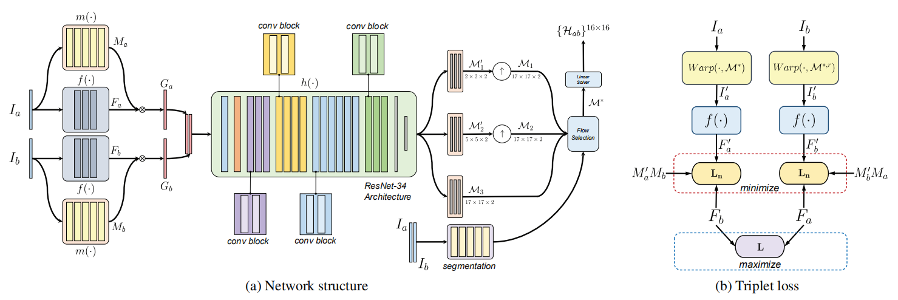
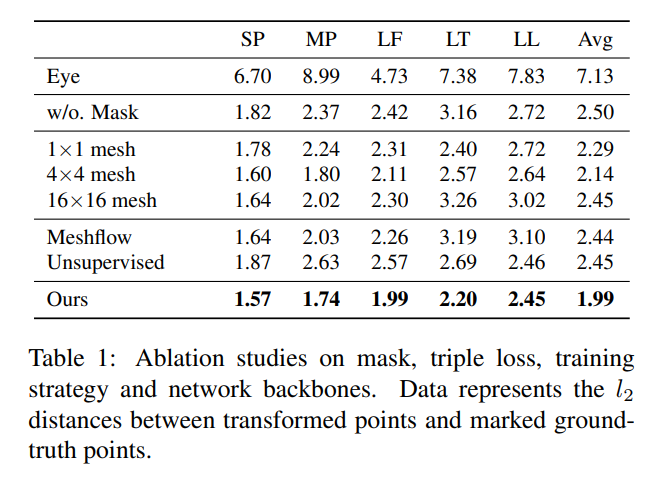
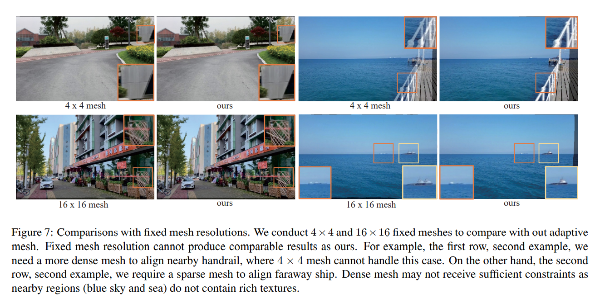
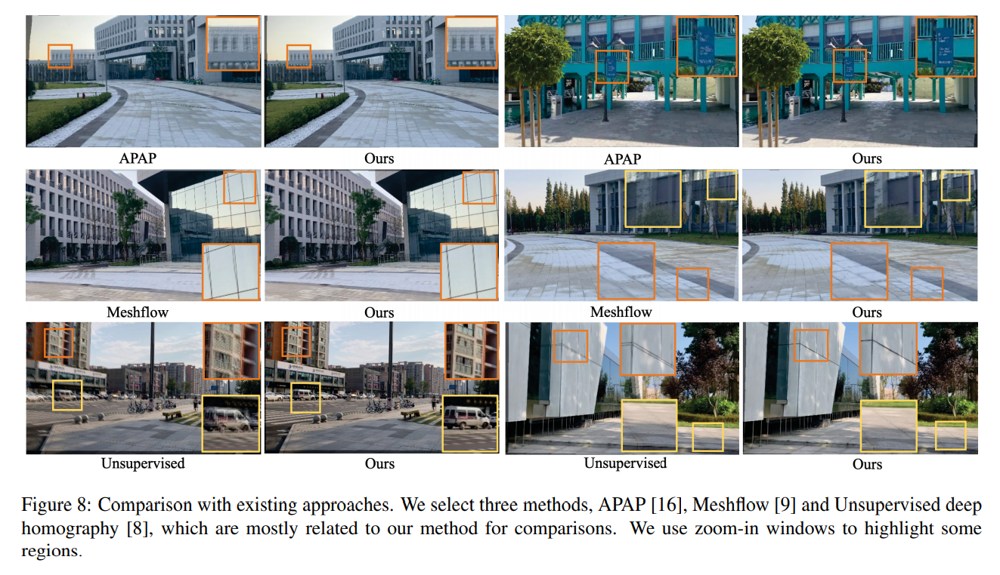

#  DeepMeshFlow: Content Adaptive Mesh Deformation for Robust Image Registration

本文在content-aware网络的基础上提出基于内容自适应的deep meshflow估计网络，该网络生成几类特定大小的mesh flow，再通过融合掩码得到最终结果。该方法将deep homography对低纹理区域具有鲁棒性的优点和meshflow可以描述非线性运动的特点。

   

> - 论文来源：[DeepMeshFlow: Content Adaptive Mesh Deformation for Robust Image Registration](https://arxiv.org/pdf/1912.05131.pdf)
> - 数据集：合成数据集MSCOCO2014/2017、视频数据集Content-Aware-DeepH-Data
> - 代码：(暂无源码)

   

## 网络结构

本文网络结构的前半部分与content-aware的网络结构相同，此处不赘述。

    

- $f(\cdot)$：特征提取网络，全由卷积层构成，输出特征图$F_a、F_b$。
  $$
  F_a={\cal f}(I_a),　　F_b={\cal f}(I_b)
  $$
  
- $m(\cdot)$：掩码预测网络，全由卷积层构成，输出掩码$M_a、M_b$。通过对掩码进行归一化处理并且加大权重后可以达到**突出特征图中重要内容**的效果，该效果**类似传统算法中的RANSAC**。

$$
M_a=m(I_a),　G_a=F_aM_a,      M_b=m(I_b),　G_b=F_bM_b
$$

- $h(\cdot)$：meshflow回归网络，backbone为ResNet-34，输出K个mesh flow。
  $$
  \{ M_k\} =h(G_a,G_b),　k=1,2,...,k
  $$

- $s(\cdot)$：场景分割网络，该网络将图像$I_a、I_b$堆叠后分割为K类，分别对应上述的K个分支，输出尺寸为$(H_g+1)\times (W_g+1)\times K$

$$
S=s(I_a,I_b)
$$

- K Branches：ResNet-34后接K个分支，每个分支由自适应池化层开始，经过卷积层生成特定大小的mesh flow。
  $$
  M_1^{'}\rightarrow ({H_g\over 16}+1)\times({W_g\over 16}+1)\times 2=2\times 2\times 2 \\
  M_2^{'}\rightarrow ({H_g\over 4}+1)\times({W_g\over 4}+1)\times 2=5\times 5\times 2 \\
  M_3\rightarrow ({H_g}+1)\times({W_g}+1)\times 2=17\times 17\times 2
  $$
  之后将粗尺度$M_1^`、M_2^`$上采样到$M_3$分辨率，并且依靠场景分割网络$S$加以融合，得到最终结果$M^*$。
  $$
  M^*(u,v)=M_{\hat k}(u,v)　\hat{k}=argmax_kS(u,v,k)
  $$
  即按照掩码中的最大值选择mesh flow中的对应值。

  ## 损失函数

  本文的损失函数与content-aware中的相同

  - 如果估计的单应性矩阵$\cal H_{ab}$足够正确，则经过变换后的特征图$F_a^{'}$和目标特征图$F_b^{'}$对齐效果会很好，故$l_1 loss$也很低。考虑到真实场景中单个单应性矩阵不能满足两个视图之间的转换，本文使用了$M_a^{'}、M_b$对$l_1loss$进行了归一化：

  $$
  L_n(I_a^{'},I_b)={\sum_i M_a^{'}M_b\cdot |F_a^{'}-F_b|\over {\sum_i M_a^{'}M_b}}
  $$

  - 当特征图是全零的时候使用上述式子会比较片面，因为这只证明$I_a^{'}、I_b$对齐效果好，但无法证明原图$I_a、I_b$未对齐，故需要最小化另一个损失：
    $$
    L(I_a,I_b)=|F_a-F_b|
    $$

  - 同时作者将图像交换求解$M^{*,r}$，并且相应地计算损失$L_n(I_b^{'},I_a)$。在这基础上增加损失确保$M^{*}、M^{*,r}$互为逆矩阵，增加超参数$\lambda、\mu$后最终损失为：
    $$
    min_{m,f,h}L_n(I_a^{'},I_b)+L_n(I_b^{'},I_a)-\lambda L(I_a,I_b)+\mu \sum_{(u,v)}|\cal H_{ab}(u,v)H_{ba}(u,v)-I|
    $$
    

  ## 实验结果

  

- 本文与content-aware创新点主要在mask的使用，它可以消除对齐时不可分辨或者具有误导性的区域，比如低纹理或者运动物体。

    

- 对比实验中使用$l2$距离来衡量拼接质量的好坏，结果表示本文的方法相比之前的方法达到最优，同时对比了各个尺寸的mesh的效果，本文的自适应尺寸mesh效果最优

    

    

    

## 结论

- 本文在content-aware的基础上预测meshflow，同时提出了一种自适应的多尺度meshflow的计算方式。该方法在解决视差有较好效果。

