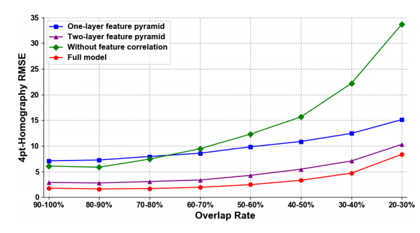
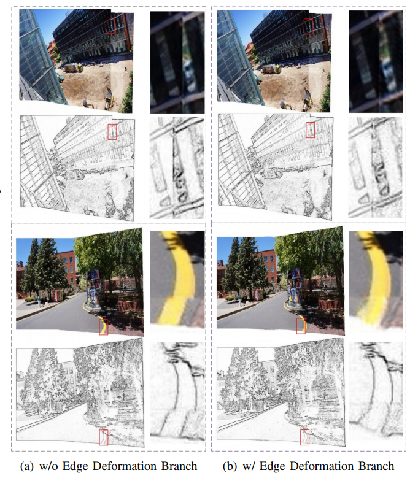

# Learning Edge-Preserved Image Stitching from Large-Baseline Deep Homography

***
本文提出了一个监督图像拼接学习框架由Large-Baseline Deep Homography与edge preserved deformation两个模块组成。分别实现deep homography estimation和deep image stitching的效果。该网络可以接受任意尺度的图像，即使在合成数据集中进行训练，在真实图像中也有良好的泛化能力

   

> - 论文来源：[Learning Edge-Preserved Image Stitching from Large-Baseline Deep Homography](https://arxiv.org/pdf/2012.06194.pdf)
> - 数据集：Stitiched MS-COCO
> - 代码：(源码暂未开源)

   

## 1.Large-Baseline Deep Homography
在大基线场景当中，图像间的重合率很低，CNN的感受野明显受阻。针对此问题本文设计了**large-baseline deep homography network**，该网络将**feature pyramid**与**feature correlation**关联结合，提高了特征映射的利用率，同时拓展了模型的感受野。
 

### A. Feature Pyramid

网络整体结构类似FPN网络,经过8个卷积核层与3个池化层分别得到尺寸为$\frac{1}{2}$、$\frac{1}{4}$、$\frac{1}{8}$的三层特征金字塔。每层特征金字塔都用来估计单应性。该方法**在特征级上由粗到精地估计单应性**。

### B. **Feature Correlation**

参考特征图$F_A$​​和目标特征图$F_B$​​尺寸均为$W\times H\times C$​​，可视为由$W \times H$​个维度为$C$​​的特征向量组成。可用余弦相似度计算两个图上任意两点间的相关性：
$$
c(x_A,x_B)={<F_A(x_A),F_B(x_B)> \over|F_A(x_A)||F_B(x_B)|}
$$
其中$x_A$​、$x_B$​分别表示特征图$F_A$​、$F_B$​上的空间位置。假设搜索半径为$R$​，最终可以得到$W\times H\times (2R+1)^2$​​的feature correlation图。假设$W=H$​，当$R=W$​时该步骤称为Global Correlation，当$R<W$​​​​​​时该步骤称为Local Correlation。该方法**实现了特征匹配的效果**。

将Feature Correlation图投入到由3个卷积层与2个全连接层组成的Regression Network中可以得到八坐标偏移。再经过Solving DLT模块得到单应性矩阵，由于生成的时多尺度特征金字塔，所以需要先进行尺度转换再计算单应性矩阵。

每次由高层计算得到的单应性矩阵，将下一层目标特征图进行warp变换后继续与和其同层的参考特征图计算**残差**的八坐标偏移。每次计算Solving DLT的时候需要的是总偏移量，所以需要加上剩余的偏移量。

综上所述可得到最终表达式：
$$
\Delta_i=H_{4pt}\Bigg\{F_A^{{1 \over 2}^{4-i}},{\cal W} \Bigg<F_B^{{1 \over 2}^{4-i}},{\cal DLT}(\sum^{i-1}\_{n=0}{\Delta_n}) \Bigg> \Bigg\}
$$

由于特征金字塔为三层，最终预测的偏移量表达为：

$$
\Delta_{w\times h}=\Delta_1+\Delta_2+\Delta_3
$$

### C. Objective Function

该网络以监督方式训练，损失函数为：
$$
{\cal L_H}=w_1(\hat{\Delta_{w\times h}}-\Delta_1)+w_2(\hat{\Delta_{w\times h}}-\Delta_1-\Delta_2)+w_3(\hat{\Delta_{w\times h}}-\Delta_1-\Delta_2-\Delta_3)
$$

## **Edge-Preserved Deformation Network**

全局单应性图像拼接容易产生伪影，本文设计了edge-preserved deformation network来学习从边缘到内容的图像拼接规则。该网络采用encoder-decoder模式，以边缘不连续性为代价消除伪影，以边缘保留策略学习纠正不连续性。

### A. Edge Deformation Branch

边缘仅包含图像中对象的轮廓，保留边缘进行拼接效率更高。边缘提取方式：
$$
E_{i,j}=|G_{i,j}-G_{i-1,j}|+|G_{i,j}-G_{i,j-1}|
$$
该分支卷积核为64, 64, 128, 128, 256, 256, 512, 512, 256, 256, 128, 128, 64, 64, 1,每两个卷积层后接上一个最大池化层与或者一个反卷积层。为了避免梯度消失与信息不平衡等问题，使用skip connection(shortcut connection)连接encoder与decoder同尺度的层。

### B. Image Deformation Branch

该分支在缝合边的引导下生成缝合图像。为了实现边缘保持图像拼接，在decoder阶段使用edge deformation branch学习的边缘特征来引导学习。最后使用fusion block将两个分支的最后的特征图融合起来。

### C. Objective Function

网络损失函数分为边缘损失与内容损失
$$
L_{edge}={1 \over W\times H\times 1}||\hat{E}-E||_1
$$

$$
L_{content}={1\over {W_j\times H_j\times C_j}}||\Phi_j(\hat{I})-\Phi_j(I)||_2
$$

$$
L=\lambda_eL_{edge}+\lambda_cL_{content}
$$

$\hat E$​由grond truth$\hat{I}$​经过边缘提取后得到的边缘图像，$W、H$​表示拼接图像的宽与高，$\Phi_j$​表示VGG19第$j$​层的结果，$W_j、H_j、C_j$​表示第$j$​层特征图的宽、高、通道数。内存损失的设计有利于image deformation branch生成感知自然的拼接图像。

## Size-Free Stitching

该网络可以处理任何尺寸大小的图像：

1. 将$W \times H$尺寸大小的输入图像调整为$w\times h$​​，并且记录尺度因子$\sigma_w、\sigma_h$​。
2. 将$w\times h$​尺寸大小图像投入网络并且评估偏移量。
3. 根据尺度因子调整偏移量大小。

输入图像尺度的增加会很大程度上增加计算机的负担，以global correlation为例，尺度变化$\lambda$倍会导致运算量变化$\lambda^4$​倍:
$$
W\times H\times (2W+1)^2\Rightarrow \lambda W\times \lambda H\times (2\lambda W+1)^2
$$

## Experiment

在四顶点增加随机perturbation$[-\rho,\rho]$​与随机​translation$[-\tau,\tau]$获得大基线、低重合度的图像，格式为$(I_{Reference},I_{Target},\Delta,Label)$​。

论文数据集中图像尺寸$W\times H$​;patches尺寸${W\over {2.4}}\times {H\over {2.4}}$​;$Max_{perturbation}$为$0.5P^W\times 0.5P^H$​;$Max_{translation}为$$0.2P^W\times 0.2P^H$​；投入网络图像尺寸$w\times h$为$128\times 128$​​;​​

***对比实验结果***

***特征金字塔消融实验结果***

***Edge Deformation Branch消融实验结果***

## Conclusion

* 提出了**large-baseline deep homography network**来实现单应估计与图像配准；**edge-preserved deformation**模块学习图像拼接的变形规则；采用方案使得该网络可以接受**任意尺度**的图像。
* 该网络仅在合成数据集中训练得到的模型在真实图像中也有较好效果。

