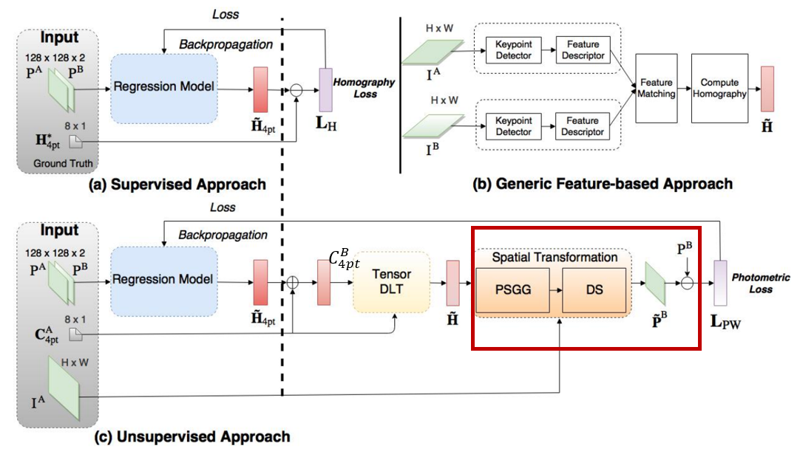

# Unsupervised Deep Homography: A Fast and Robust Homography Estimation Model 
###### 本篇论文提出一个基于非监督学习单应矩阵的神经网络，是在Daniel D.T.等人发表的Deep Homography Estimation论文上的一个改进方案。Daniel的网络在合成数据集上虽然能呈现较好的结果，但在真实数据集上仍然存在较大的误差。本文通过重新定义损失函数，将4-points的差值转化为图像像素级的差值来实现反向传播。论文中提出利用Spatial Transform Layer实现图像的变形。<br/><br/><br/>


> - 论文来源：[Nguyen, T., Chen, S. W., Shivakumar, S. S., Taylor, C. J., & Kumar, V. (2018). Unsupervised deep homography: A fast and robust homography estimation model. IEEE Robotics and Automation Letters, 3(3), 2346-2353..(pdf)](https://arxiv.org/pdf/1709.03966)
> - 数据集：1. 合成数据集MSCOCO2014/2017     2. 真实数据集(未开源)
> - 参考主页：[tynguyen](https://github.com/tynguyen/unsupervisedDeepHomographyRAL2018)（项目源码）


<br/><br/><br/>


## 1. 主要思路
本文利用Daniel监督学习的回规模型学习出四个点的偏移量（8维tensor），因为要根据这个输出得到两幅patch之间的单应矩阵$\tilde{H}$，所以需要增加一个新的输出，也就是patchA四个顶点的初始值。

#### 单应矩阵DLT求解
下图中红色方框中就是本文网络框架中新增的输入：**patchA四个顶点的初始坐标$C_{4pt}^{A}$**，和**图A原图$I_A$**（非patch）。初始坐标加上预测出的8个偏移量，可以得到patchB的四个顶点坐标，四个顶点对应四个顶点，通过DLT求解之间存在的单应变换矩阵。


<br/>

> 见下图标出的两个输入tensor DLT的箭头，分别就是patchA的四个坐标和patchB的四个坐标，输入进DLT模块。

<br/>
<div align=center>

</div>


<br/><br/><br/>
#### Photometric Loss函数
与Deep Homography Estimation论文中loss函数的构造方式不同，Daniel论文利用8个参数的GT和预测值之间的**欧式距离**作为loss———本篇论文则是利用预测的8个值按照DLT方法求解单应矩阵，单应矩阵对图像进行变形，loss函数是由参考图像和变形后图像像素的**L1范式距离**决定的。
<br/>

> 如下图所示，从DLT中计算得到的单应矩阵$\tilde{H}$，和patchA的原图$I_A$

<br/>
<div align=center>
  
</div>
<br/>
<div align=center>
  
</div>

<br/><br/><br/><br/><br/><br/>
## 2. 数据集
本文依旧采用了Deep Homography Estimation中提出合成数据集来训练网络，除此之外为了增加网络对真实环境的适应性，本文还引入了作者团队拍摄的航空图像（未开源）
  
### 合成数据集代码示例


<br/><br/><br/>
## 3. 网络结构
  
<br/>


```python

```


<br/><br/>
## 4. 实验结果


<br/>

<center>
<figure>
  
</figure>
 </center>


<br/><br/><br/><br/><br/><br/><br/><br/><br/><br/>
#### 结论


<br/><br/><br/>


## 5.复现实验
### 合成数据集实验

### 真实数据集实验


待补充...

