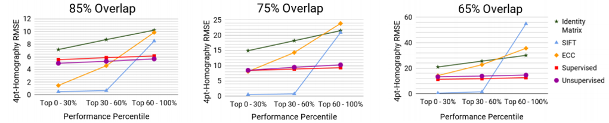

# Unsupervised Deep Homography: A Fast and Robust Homography Estimation Model 
###### 本篇论文提出一个基于非监督学习单应矩阵的神经网络，是在Daniel D.T.等人发表的Deep Homography Estimation论文上的一个改进方案。Daniel的网络在合成数据集上虽然能呈现较好的结果，但在真实数据集上仍然存在较大的误差。本文通过重新定义损失函数，将4-points的差值转化为图像像素级的差值来实现反向传播。论文中提出利用Spatial Transform Layer实现图像的变形。<br/><br/><br/>


> - 论文来源：[Nguyen, T., Chen, S. W., Shivakumar, S. S., Taylor, C. J., & Kumar, V. (2018). Unsupervised deep homography: A fast and robust homography estimation model. IEEE Robotics and Automation Letters, 3(3), 2346-2353..(pdf)](https://arxiv.org/pdf/1709.03966)
> - 数据集：1. 合成数据集MSCOCO2014/2017     2. 真实数据集(未开源)
> - 参考主页：[tynguyen](https://github.com/tynguyen/unsupervisedDeepHomographyRAL2018)（基于tensorflow的项目源码）


<br/><br/><br/>


## 1. 主要思路
本文利用Daniel监督学习的回归模型学习出四个点的偏移量（8维tensor），因为要根据这个输出得到两幅patch($P_A$, $P_B$)之间的单应矩阵$\tilde{H}$，所以需要增加一个新的输入，也就是patchA四个顶点的初始值。

#### 单应矩阵DLT求解
下图中红色方框中就是本文网络框架中新增的输入：**patchA四个顶点的初始坐标$C_{4pt}^{A}$**，和**图A原图$I_A$**（非patch）。初始坐标加上预测出的8个偏移量，可以得到patchB的四个顶点坐标，四个顶点对应四个顶点，通过DLT求解之间存在的单应变换矩阵。


<br/>

> 见下图标出的两个输入tensor DLT的箭头，分别就是patchA的四个坐标和patchB的四个坐标，输入进DLT模块。

<br/>
<div align=center>

</div>


<br/><br/><br/>
#### Photometric Loss函数
与Deep Homography Estimation论文中loss函数的构造方式不同，Daniel论文利用8个参数的GT和预测值之间的**欧式距离**作为loss———本篇论文则是利用预测的8个值按照DLT方法求解单应矩阵，单应矩阵对图像进行变形，loss函数是由参考图像和变形后图像像素的**L1范式距离**决定的。
<br/>

> 如下图所示，从DLT中计算得到的单应矩阵$\tilde{H}$，和patchA的原图$I_A$一齐输入到Spatial Transform模块内，该模块是以采样的形式来实现图像的变形的（我们在理解该概念时查阅了Spatial Transform Layer/Network等相关资料），本文中也详细介绍了STL的实现原理。

<br/>
<div align=center>
  
</div>
<br/><br/>

在Spatial Tranform阶段，之前项目中采用的OpenCV的warpPerspective自然不能使用，这时以下图图例的方式来帮助理解。
> 1. 首先，构建一个和原图B$I_B$一样大的图$V$，图示$V$网格上的每一点$({u_i}\', {v_i}\')$就是对应$I_B$的每个像素点$({u_i}\', {v_i}\')$。图$V$实际就是由矩阵和A转换过来的图像。
> 2. 图$V$上每个像素的点实际是**从$I_A$中采样**出来的。由于之前在DLT阶段由$P_A$和$P_B$得到了图像$I_A$到$I_B$的矩阵$\tilde{H}$，可以计算出$I_B$到$I_A$的矩阵$\tilde{H}\_{inv}$。
> 3. 根根据矩阵$\tilde{H}\_{inv}$可以将$V$中的像素(假设坐标为$({u_i}\', {v_i}\')$)映射到$I_A$中的坐标$(u,v)$上，即图$V$中每个像素的值就完全是取自$I_A$。
> 4. 由于坐标$(u,v)$可能出现浮点型数据，而图像是离散型变量，因此需要根据$(u,v)$周围的**4个像素**进行**双线性差值**。利用图中的公式：
> $$ V_{i}^{C}=\sum_{n}^{H}\sum_{m}^{W}I_{mn}^{c}max(0,1-\left|u_i-m \right|)max(0,1-\left|v_i-n \right|) $$
> 5. 最后得到的$V$是利用预测值$\tilde{H}\_{inv}$采样得到的图像，它和$I_B$同时取patchB位置的图像，loss函数则是计算$P_B$和$\tilde{P}\_B$的**L1范式距离**。

<br/>
<div align=center>
  
</div>

<br/><br/><br/><br/><br/><br/>
## 2. 数据集
本文依旧采用了Deep Homography Estimation中提出合成数据集来训练网络，除此之外为了增加网络对真实环境的适应性，本文还引入了作者团队拍摄的航空图像（未开源）
  
### 合成数据集
> 生成合成数据集的源码文件[gen_synthetic_data.py](https://github.com/tynguyen/unsupervisedDeepHomographyRAL2018/blob/master/code/utils/gen_synthetic_data.py)
<br/>
该网络新增了几个输入，合成数据集构建时除了存储patchA、patchB和GT之外还需要存储原图$I_A$以及$I_B$。在以下源码中，作者存储$P_A$的四个点的坐标(f_pts1)，两幅图像之间的单应矩阵(f_gt)，两个图像原图的文件名(f_file_list)。 

<br/>


```python
  # Text files to store homography parameters (4 corners)
  if args.mode=='train' and not args.debug:
    f_pts1      = open(args.pts1_file, 'ab')
    f_gt        = open(args.gt_file, 'ab')
    f_file_list = open(args.filenames_file, 'ab')
...
...
  np.savetxt(f_gt, [gt], delimiter= ' ')
  np.savetxt(f_pts1, [pts1], delimiter= ' ')
  f_file_list.write('%s %s\n'%(str(index)  +'.jpg', str(index)  +'.jpg') )
```

<br/>
合成数据集因为只有单张图像，看论文的时候觉得$I_B$的指向性不明确。在查阅源码后，发现合成数据集的$I_B$实际上是对$I_A$进行$H_{inv}$矩阵透视变换后的图像，见下方代码。
<br/>

```python
  # compute Homography 
  H = cv2.getPerspectiveTransform(np.float32(four_points), np.float32(perturbed_four_points))
  try:
      H_inverse = inv(H)
    except:
      print "singular Error!"
      return index, 0
  ...
  ...
  inv_warped_image = numpy_transformer(gray_image, H_inverse, (width, height))
  ...
  ...
  # Save synthetic data
    large_img_path    = os.path.join(args.I_dir, str(index) + '.jpg')

    if args.mode == 'train' and args.color==False:
      cv2.imwrite(large_img_path, gray_image)
  ...
  ...
    if args.I_prime_dir is not None:
      img_prime_path = os.path.join(args.I_prime_dir, str(index) + '.jpg')
      if args.mode == 'train' and args.color==False:
        cv2.imwrite(img_prime_path, inv_warped_image)
  
```


gray_image和inv_warped_image在这里就分别代表$I_A$和$I_B$。


<br/><br/>
### 无人机拍摄的真实数据集（未开源）


<br/><br/><br/>
## 3. 网络结构
本文的网络结构在回归四个顶点偏移量的时候借用了Deep image Homography Estimation的回归网络模型，后续的模块在计算损失函数的时候借用了Spatial Transform Layer的方案。
<div align="center">
  
  </div>
<br/>


详见项目源码，utils文件夹内包含生成合成数据集和真实场景数据集的代码、图像空间变换的功能函数。code文件夹内homography_CNN_\*是深度神经网络方法在两个数据集上的训练代码。homography_Conventional_\*是传统方法代码。homography_model是本文网络结构源码，具体结构与监督方法的回归网络模型基本一致，如下（文件line88-133）：
```python
def _vgg(self):
    with tf.variable_scope('conv_block1', reuse=self.reuse_variables): # H
      conv1 = self._conv_block(self.model_input, ([64, 64]), (3, 3), (1, 1))
      maxpool1 = self._maxpool2d(conv1, 2, 2) # H/2
    with tf.variable_scope('conv_block2', reuse=self.reuse_variables):
      conv2 = self._conv_block(maxpool1, ([64, 64]), (3, 3), (1, 1))
      maxpool2 = self._maxpool2d(conv2, 2, 2) # H/4
    with tf.variable_scope('conv_block3', reuse=self.reuse_variables):
      conv3 = self._conv_block(maxpool2, ([128, 128]), (3, 3), (1, 1))
      maxpool3 = self._maxpool2d(conv3, 2, 2) # H/8
    with tf.variable_scope('conv_block4', reuse=self.reuse_variables):
      conv4 = self._conv_block(maxpool3, ([128, 128]), (3, 3), (1, 1))
      # Dropout
      keep_prob = 0.5 if self.mode=='train' else 1.0
      dropout_conv4 = slim.dropout(conv4, keep_prob)

    # Flatten dropout_conv4
    out_conv_flat = slim.flatten(dropout_conv4)

    # Two fully-connected layers
    with tf.variable_scope('fc1'):
      fc1 = slim.fully_connected(out_conv_flat, 1024, scope='fc1')
      dropout_fc1 = slim.dropout(fc1, keep_prob)
    with tf.variable_scope('fc2'):
      fc2 = slim.fully_connected(dropout_fc1, 8, scope='fc2', activation_fn=None) #BATCH_SIZE x 8

    self.pred_h4p = fc2
```


<br/><br/>
## 4. 实验结果
### 合成数据集
测评指标为四个点偏移量的**均方根误差(RMSE)**。重叠率表示的是$P_A$四个顶点有较小的偏移($P_A$和$P_B$的重叠率为85%)。作者将本文的方法和单位矩阵、SIFT、ECC和基于监督的方法进行比较。<br/>
- 重叠率85%
> 在重叠率较大的情形下，
- 

<br/>
<div align="center">

</div>


<br/><br/><br/><br/><br/><br/><br/><br/><br/><br/>
#### 结论


<br/><br/><br/>


## 5.复现实验
### 合成数据集实验

### 真实数据集实验


待补充...

