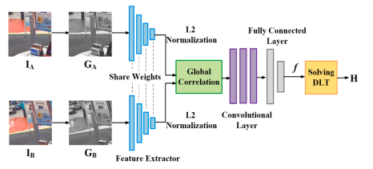
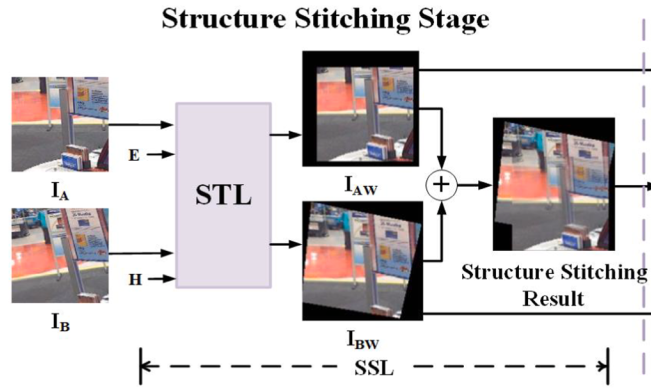
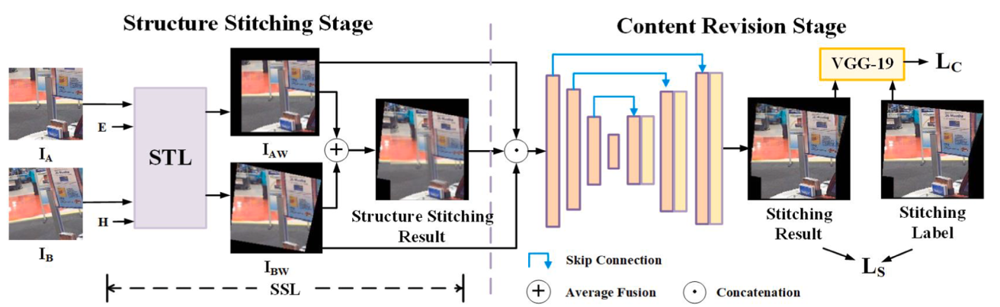

# A view-free image stitching network based on global homography
## 主要创新点
**在已有的深度学习方法上，本文针对小重叠率的情况进行研究:**
> 1. 改进合成数据集的生成方案——原有的方法只是对四个顶点进行扰动，改进方案则是先对原始的patch做一个平移，以此来获取更小的重叠率。原始方案的重叠率在60%以上，改进方案的重叠率在20%以上。
> 2. 改进单应矩阵的估计方法——采用*global correlation homography estimation*的方法，使用图像的全局相关性操作构建损失函数。
> 3. 在STL的基础上增加了*structure stitching*方法——即将STL得到的映射结果使用*average fuse*的融合方法，得到粗略的拼接效果。
> 4. 在网络中引入*Content revision*去除重影——使用*encoder-deconder*网络去重影。
## 主要步骤
### 数据准备

**真实标签为(I_A, I_B, f, Label)**

- f是在顶点扰动的基础上增加了平移向量：
$$
f^i_x=p^i_x+t_x\\
f^i_y=p^i_y+t_y
$$
- Label是拼接的结果，由图中绿色框和红色框组成，并且最终将结果放到304\*304的canvas中。
### Step1: Homography estimation stage
传统单应矩阵估计一般会经过：特征点提取、特征匹配、DLT，最终得到单应性矩阵。已有的深度学习方案都直接使用CNN回归网络得到单应性矩阵。

本文模拟传统方法，先使用一个CNN提取图像的特征并计算*global correlation*，再经过卷积+全连接层得到四个偏移量，最后通过DLT求得单应性矩阵*H*。

**Input**
> 将输入的两幅图像转换成灰度图像

**Feature Extractor**
> 两幅图像使用同样的权重，每一个模块都是**两层卷积+一层最大池化层**

**L2 normalization**
> 需看源码

**global correlation**
> 将得到的两个feature maps $F_A, F_B\in W^l\times H^l\times C^l$进行全局的相关操作，得到$CV^l$
> $$
> CV^l(x_1,x_2)=\frac{<F_A^l(x_1), F_B^l(x_2)>}{|F_A^l(x_1)||F_B^l(x_2)|}\quad x_1,x_2\in \Z^2
> $$
- $F_A^l(x_1)$表示在$x_1$处的像素值，每一个像素值是一个维度为$C^l$的向量，这里的<>表示点乘。
- 对feature1中的每一个像素点，计算第二幅图像中所有像素点与该点的correlation值，得到一个$W^l\times H^l$的向量。因此$CV^l$的大小为$W^l\times H^l\times (W^l\times H^l)$。
- $CV^l(x_1,x_2)$的值在0~1之间，这个值越大则表示两个feature在$x_1,x_2$两个位置上越匹配。

**Regression network**
> 由卷积层+全连接层构成，得到四个顶点的偏移，最后通过DLT解出单应矩阵H。

### Step2: Structure stitching stage
该步骤在STL上多加了一个融合的操作，将STL得到的两幅图像通过average fusion进行融合，得到粗略的拼接效果。

- 这里的输入不再是灰度图像了，而是原始彩色图像。
- 这里STL的输出图像大小是由H计算得到的canvas大小。
- 当H不同时，即使处理同样两幅图像，最终得到的拼接图像大小都可能不同，为了实现的方便，这里将canvas的大小统一设置为304\*304(输入patch的大小为128\*128)，保证所有的structure stitching result和label(拼接的图像的ground truth)一样大。

### Step3: Content revision stage
该步骤的主要作用是去除重影。

**Input**
> 该步骤的输入是将SSL步骤中的$I_{AW}, I_{BW}$和structure stitching result进行concatenate得到的多通道图像。
- 采用encoder-decoder的结构得到Stitching result。

### Step4：Loss fuction
已有的深度学习方法都是将偏移量作为loss函数考虑的对象，该论文除了将偏移量考虑在内，同时也将图像的拼接结果作为loss函数的一部分。

**$L_H$**

主要考虑图像四个顶点的偏移与ground truth之间的误差:
$$
L_H(\hat{f}, f)=\frac{||\hat{f} - f||_2^2}{N}
$$
N表示偏移由多少个量构成，一般是四个点，八个偏移量。

**$L_S$**

主要考虑拼接效果与ground truth之间的误差：
$$
L_S(\hat{I}, I)=\frac{||\hat{I}-I||_1}{W\times H\times C}
$$
这里采用的是L_1 Loss。

**$L_C$**

主要考虑拼接结果的feature与ground truth的feature之间的误差
$$
L_C(\hat{I}, I)=\frac{||\phi_j(\hat{I})-\phi_j(I)||_2^2}{W_j\times H_j\times C_j}
$$
$\phi_j(.)$表示VGG_19的第j层结果。
> 这个Loss是最终减少重影的关键

## 总结
1. 在计算全局单应矩阵时，传统方法在特征点少重叠率低的情况下，容易出现无匹配和匹配错误。考虑到CNN强大的特征提取能力，以后应该考虑更多的使用深度学习的方法去计算单应性矩阵。
2. 本文去重影的方法——Content Revision，可以考虑在以后的拼接中作为后处理来使用。
